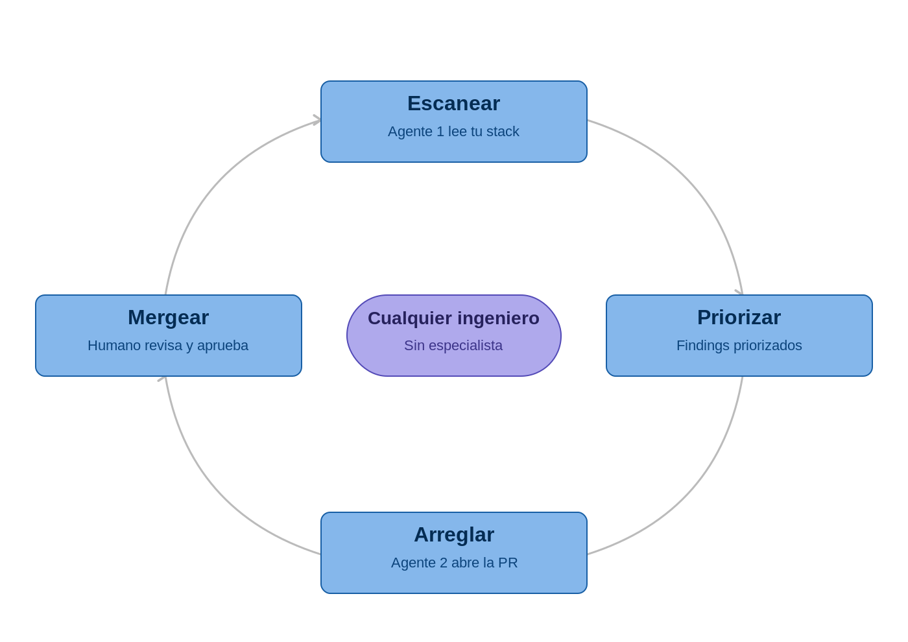

# aws-hardening

> Hardening de cuentas AWS, modernizado para 2026. Cualquier ingeniero del equipo puede hacerlo. Sin especialista dedicado.

Este repo es el companion de la charla **"Reforzando la seguridad en tus cuentas de AWS"** presentada en [AWS Community Day Chile 2026](https://www.awscommunitydaychile.com/). Si llegaste acá después de la charla, esta es la ruta para hacer en tu organización lo que viste en escena.

## La tesis en una línea

Ya no se necesita un especialista dedicado en seguridad con herramientas especiales y procesos difíciles. Un ingeniero de tu equipo, con un agente de IA local, puede correr este ciclo cada semana y mejorar la postura de seguridad de forma iterativa.

## El patrón

Cuatro etapas, una sola dirección, una persona al volante.

1. **Escanear.** Un agente lee tu stack (infra, backend, frontend) en tu ambiente local, en contenedores. Cero datos saliendo de tu laptop.
2. **Priorizar.** El mismo agente clasifica los findings por impacto y blast-radius. Output: un informe ordenado, no un cementerio de findings sueltos.
3. **Arreglar.** Un segundo agente abre una pull request por finding, con el fix propuesto.
4. **Mergear.** Vos como humano revisás y aprobás. El gate sigue siendo humano. Volvés a escanear.

Cada vuelta cierra findings reales. La seguridad pasa de ser un proyecto bloqueante a una práctica cotidiana.

## Por dónde empezás el lunes

Tres cosas concretas. Ninguna requiere presupuesto. Todas se hacen en una mañana.

1. **MFA en root donde no lo tenés** (90 segundos). El cambio más barato y de mayor impacto que existe en AWS.
2. **Elegí UN ítem de Nivel 2 y agendalo para tu próximo sprint** (10 minutos). Mirá la sección [Modelo de madurez](#modelo-de-madurez) y elegí cuál te duele menos.
3. **Corré un prompt con tu agente de IA favorito.** En `prompts/security-review.md` tenés uno listo: copialo, pegáselo a Claude, GPT, Kiro, Cursor, el que uses. Te devuelve un reporte priorizado de vulnerabilidades de infra y código. Eso es tu Nivel 0, tu punto de partida.

## Lo que hay en este repo

| Carpeta | Qué contiene | Cuándo usarlo |
|---------|--------------|---------------|
| [`prompts/`](./prompts) | Prompts listos para copiar y pegar en tu agente favorito. Audit de seguridad, generación de fixes, revisión de PRs. | Lunes a la mañana. Cuando querés un escaneo rápido sin instalar nada. |
| [`specs/`](./specs) | Specs por nivel del maturity model. Definen qué cuenta como "fortificado" en cada nivel. | Cuando estás listo para que un agente Kiro/Claude Code/Cursor lea el spec y abra PRs contra tu infra. |
| [`demos/`](./demos) | Tres demos completas del loop: `kiro/`, `claude-code/`, `cursor/`. Cada una tiene un README, un repo de Terraform de ejemplo, y la grabación. | Cuando querés ver el patrón en acción antes de implementarlo. |
| [`playbooks/`](./playbooks) | Playbook de incident response: credencial filtrada, S3 público accidental, escalación IAM. | Cuando algo ya pasó y necesitás ejecutar pasos sin pensar. |
| [`templates/`](./templates) | Templates de SCP, configs de IMDSv2, defaults de KMS, baseline de GuardDuty. | Cuando avanzás del Nivel 1 al Nivel 2. |
| [`assessment-cli/`](./assessment-cli) | CLI en Python que corre las 8 preguntas del diagnóstico contra una cuenta AWS y te devuelve un scorecard. | Cuando querés métricas programáticas y no solo el output del agente. |

## Modelo de madurez

Este repo está organizado contra el **AWS Security Maturity Model**, publicado y mantenido por [Darío Goldfarb](https://maturitymodel.security.aws.dev/en/model/). El modelo no es mío, es de Darío. Lo que yo aporto es la versión gamificada y los implementations references.

| Nivel | Nombre | Duración | Costo | Boss fight |
|-------|--------|----------|-------|------------|
| 1 | El Despertar | 1 día | $0 | Encontrar y darle dueño a las cuentas huérfanas. |
| 2 | Los Cimientos | 1 semana | $0 | Tu primera SCP sin romper producción. |
| 3 | La Atalaya | 1 mes | $$ | Automatizar el primer playbook de incident response. |
| 4 | La Ciudadela | 1 trimestre+ | $$$ | Red team y blue team reales corriendo en cadencia. |

Cada nivel tiene su spec en [`specs/nivel-X/`](./specs). Si querés el detalle completo del modelo, andá al [sitio original de Darío](https://maturitymodel.security.aws.dev/en/model/), está todo más profundo de lo que vamos a cubrir acá.

## La charla

Si no la viste, los slides están en [`talk/`](./talk). Cubre tres cosas: dónde estás parado hoy, cómo cerrar el gap, y cómo conseguir que tu CTO apruebe el esfuerzo.

## Cómo contribuir

Si encontrás un finding que el agente no detectó, o un playbook que mejoró tu respuesta a un incidente real, abrí una pull request. El repo está pensado para crecer con la práctica de la comunidad.

## Licencia

MIT. Usalo, forkealo, presentalo en tu propio evento, citá el origen.

## Contacto

[Sergio Castiñeyras](https://linkedin.com/in/sercasti) · [sercasti.github.io](https://sercasti.github.io)

Si estás atascado con Nivel 2 en tu organización, escribime. Respondo.
